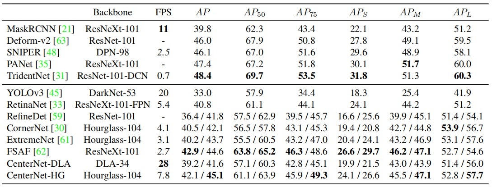

## centernet简要介绍
**若以一句话总结centernet的特点：centernet属于anchor free的目标检测算法，不需要anchor及其附带的nms就可直接检测物体。**

centernet的计算过程为：图像传入resnet，此时经过了32倍下采样；再经过3次反卷积和DCN模块，此时又经过了8倍上采样；最后再传入输出层，得到物体坐标。

**yolov3是现在比较有代表性的单阶段检测算法，下面对比一下这两种检测算法的主要不同:**
1. 典型情况下centernet使用resnet50作为backbone, yolov3使用darknet53。
1. centernet只有1个输出层，而yolov3有3个输出层。
2. yolov3的3个输出层借用了FPN的方法，而centernet没有借用。
3. 最重要的不同点是centernet没有anchor而yolov3有anchor。以coco数据集为例，centernet输出层的通道数为80类概率+2个中心点偏移量+2个宽高数值=84维；yolov3的每个输出层都有3个anchor，每个anchor需要(x, y, w, h, confidence)五个基本参数，所以共有 3 × (5 + 80) = 255维。
4. 由于yolov3每个输出点上有多个bounding box可能出现，故最后需要nms来排除iou过高的的bounding box。而centernet无需nms。

**centernet的优点：**
1. anchor free的思想让算法的训练和部署都非常整洁，训练时无anchor，检测时无nms。这是centernet的核心想法，简单有效，值得借鉴。nms由于是集合递归的运算，不容易做并行加速，bounding box随着anchor的增加而增加。nms的不同设置会极大影响检测算法的map。
2. centernet可以做到从输入图像到输出bounding box都并行计算。

**centernet的缺点：**
1. 很明显resnet不是目前用于检测最好的backbone。在imagenet上，darknet53比resnet101性能接近的情况下速度更快，所以典型情况下yolov3的backbone比centernet是占优势的。centernet完全可以使用更强的backbone达到更高的性能。
2. centernet缺少FPN等已经证实对于检测非常有效的方法，可以尝试加入。
3. centernet有个隐含的缺点是，该算法默认一个输出点只有一个center，但实际上一个输出点有多个center是可能的。但在统计过coco数据集后发现，这种情况出现的数量极少，故这种设置对map的性能影响很低。作者也尝试了一个输出点多个center的实验，结果性能没有明显区别。

**centernet对比yolov3主要区别的表格：**
||yolov3|centernet|
|-|-|-|
|backbone|darknet53|resnet50|
|DCN|false|true|
|FPN|true|false|
|deconv|false|true|
|upsample|true|false|
|output layer|3|1|
|nms|true|false|

**centernet与其他算法的性能对比如下**
